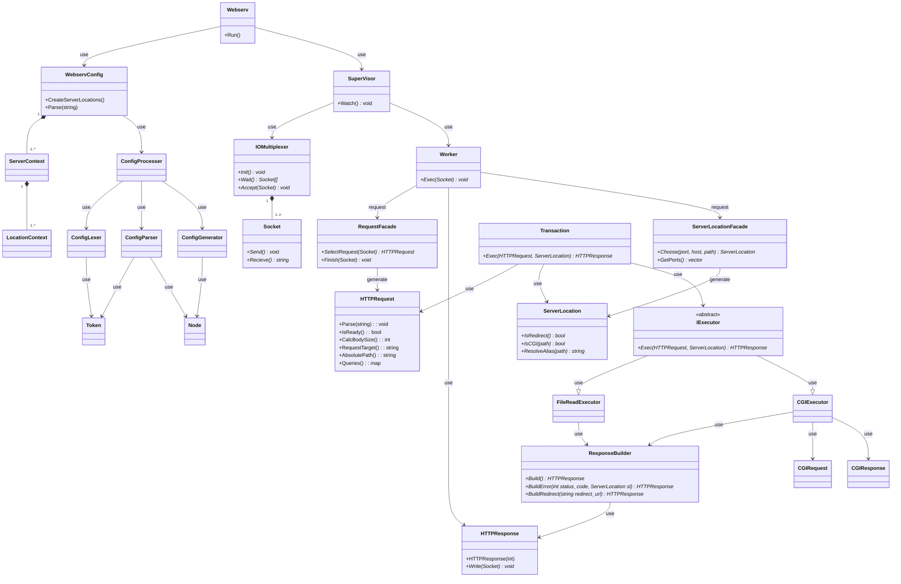

worker以降はなくて良い

```mermaid
classDiagram
    Webserv --> WebservConfig: use
    Webserv --> SuperVisor: use

    WebservConfig "1" *-- "1..*" ServerContext
    WebservConfig --> ConfigProcesser: use

    ServerContext "1" *-- "1..*" LocationContext

    ConfigProcesser --> ConfigLexer: use
    ConfigProcesser --> ConfigParser: use
    ConfigProcesser --> ConfigGenerator: use
    ConfigLexer --> Token: use
    ConfigParser --> Token: use
    ConfigParser --> Node: use
    ConfigGenerator --> Node: use


    SuperVisor --> IOMultiplexer: use
    SuperVisor --> Worker: use

    IOMultiplexer "1" *-- "1..n" Socket

    Worker --> RequestFacade: request
    Worker --> HTTPResponse: use
    Worker --> ServerLocationFacade: request

    RequestFacade --> HTTPRequest: generate

    ServerLocationFacade --> ServerLocation: generate

    Transaction --> HTTPRequest: use
    Transaction --> ServerLocation: use
    Transaction --> IExecutor: use
  
    IExecutor --|> FileReadExecutor: use
    IExecutor --|> CGIExecutor: use
  
    FileReadExecutor --> ResponseBuilder: use
  
    CGIExecutor --> ResponseBuilder: use
    CGIExecutor --> CGIRequest: use
    CGIExecutor --> CGIResponse: use

    ResponseBuilder --> HTTPResponse: use

    class ConfigProcesser {
    }
    class ConfigLexer {
    }
    class ConfigParser {
    }
    class ConfigGenerator {
    }
    class Token {
    }
    class Node {
    }

    class WebservConfig {
        +CreateServerLocations()
        +Parse(string)
    }

    %% TODO: listenディレクトリは複数指定できるかを確認 %%
    %% TODO: redirectの持ち方を検討 %%
    class ServerContext {
    }

    class LocationContext {
    }

    class Webserv {
        +Run()
    }

    %% IO多重化とソケットクラスを生成してWorkerに処理を依頼するまでを担当する%%
    class SuperVisor {
        +Watch() void
    }

  class Socket {
    +Send()* void
    +Recieve()* string
  }

  class IOMultiplexer {
    +Init()* void
    +Wait()* Socket[]
    +Accept(Socket)* void
  }

  class Worker {
    +Exec(Socket)* void
  }

  class ServerLocationFacade {
    +Choose(port, host, path)* ServerLocation
    +GetPorts()* vector<string>
  }

  class ServerLocation {
    +IsRedirect()* bool
    +IsCGI(path)* bool
    +ResolveAlias(path)* string
  }

  class RequestFacade {
    +SelectRequest(Socket)* HTTPRequest
    +Finish(Socket)* void
  }

  class HTTPRequest {
    +Parse(string): void
    +IsReady(): bool
    +CalcBodySize(): int
    +RequestTarget(): string
    +AbsolutePath(): string
    +Queries(): map<string, string>
  }

  class HTTPResponse {
    +HTTPResponse(int)
    +Write(Socket)* void
  }

  class Transaction {
    +Exec(HTTPRequest, ServerLocation)* HTTPResponse
  }

  class IExecutor {
    <<abstract>>
    +Exec(HTTPRequest, ServerLocation)* HTTPResponse
  }

  class FileReadExecutor {
  }
  class CGIExecutor {
  }
  class CGIResponse {
  }
  class CGIRequest {
  }
  class ResponseBuilder {
    +Build()* HTTPResponse
    +BuildError(int status_code, ServerLocation sl)* HTTPResponse
    +BuildRedirect(string redirect_url)* HTTPResponse
  }

```
