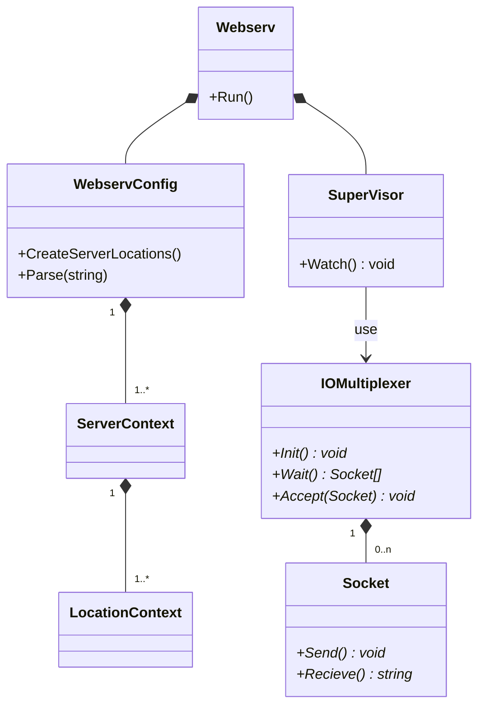

worker以降はなくて良い



## 擬似コード

```cpp

class Webserv {
    // IDEA: 別途Lexer&Parserの責務を持ったクラスを定義しても良いかもしれない。
    void Run() {
        WebservConfig config = WebservConfig.Parse()
        vector<ServerLocation> locations = config.CreateServerLocations()
        ServerLocationFacade facade(locations)
        SuperVisor sv(facade)
        sv.Watch()
    }
}

class SuperVisor {
    ServerLocationFacade facade

    void Watch() {
        IOMultiplexer iomul
        string[] port_list = ServerLocationFacade.Getpostlist()
        iomul.Init(port_list)
        while (1) {
            Socket[] sockets = iomul.Wait()
            for socket in sockets {
                if socket.IsListening()
                    iomul.Accept(socket)
                else
                    Worker.Exec(socket)
            }
        }
    }
}


class Socket {
  private:
      int socketfd
      bool is_listening

  public:
      // Responseを受け取りソケットに書き込む
      void Send(string)

      // ソケットを読み込み、何かしらのデータとして返す
      string Recieve()

      // ソケットがリスニング状態か確認
      bool IsListening()
}

// I/O多重化の債務をやってくれるやつ
class IOMultiplexer {
    private:
        // ソケット群
        Socket[] sockets

        // listen状態のソケット
        CreateListenerSocket(string port)

    public:
        // socket群を初期化するやつ
        void Init(string[] port_list) {
            for port in port_list {
                CreateListenerSocket(port)
            }
            ... // epoll固有の実装なので省略
        }

        // ソケット群がready状態になるまで待機
        Socket[] Wait() {
          ... // epoll固有の実装なので省略
        }

        // listen状態のソケットを受け取り、acceptして新しいクライアントとのソケットをソケット群に追加
        void Accept(Socket listener) {
          Socket client = listener.Accept()
          ... // epoll固有の実装なので省略
          sockets.Add(client)
        }
}

class Woker {
    void Exec() {
        HTTPRequest request = HTTPRequest.Parse(socket_)
        ServerLocation sl = facade_.Choose(port, host, path)
        HTTPResponse response = Someone.Exec(request, sl)
        HTTPResponse.Write(socket_)
    }
}

```
