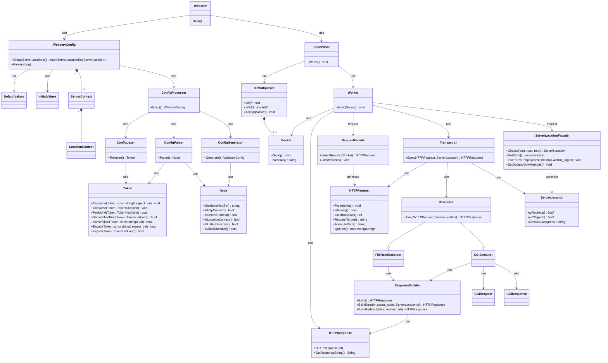

# 全体クラス図

private method, コンストラクタ、デストラクタ、setter, getter は省略。

```mermaid
classDiagram
    Webserv --> WebservConfig: use
    Webserv --> SuperVisor: use

    WebservConfig --> DefaultValues: use
    WebservConfig --> InitialValues: use
    WebservConfig "1" *-- "1..*" ServerContext
    WebservConfig --> ConfigProcesser: use

    ServerContext "1" *-- "1..*" LocationContext

    ConfigProcesser --> ConfigLexer: use
    ConfigProcesser --> ConfigParser: use
    ConfigProcesser --> ConfigGenerator: use
    ConfigLexer --> Token: use
    ConfigParser --> Token: use
    ConfigParser --> Node: use
    ConfigGenerator --> Node: use

    SuperVisor --> IOMultiplexer: use
    SuperVisor --> Worker: use

    IOMultiplexer "1" *-- "1..n" Socket

    Worker --> Socket: use
    Worker --> HTTPResponse: use
    Worker --> RequestFacade: request
    Worker --> Transaction: use
    Worker --> ServerLocationFacade: request

    RequestFacade --> HTTPRequest: generate

    ServerLocationFacade --> ServerLocation: generate

    Transaction --> HTTPRequest: use
    Transaction --> IExecutor: use
    Transaction --> ServerLocation: use
  
    IExecutor --|> FileReadExecutor
    IExecutor --|> CGIExecutor
  
    FileReadExecutor --> ResponseBuilder: use
  
    CGIExecutor --> ResponseBuilder: use
    CGIExecutor --> CGIRequest: use
    CGIExecutor --> CGIResponse: use

    ResponseBuilder --> HTTPResponse: use

    class ConfigProcesser {
      +Exec() WebservConfig
    }
    class ConfigLexer {
      +Tokenize() Token
    }
    class ConfigParser {
      +Parse() Node
    }
    class ConfigGenerator {
      +Generate() WebservConfig
    }

    class Token {
          +Consume(Token, const string& expect_val) void
          +Consume(Token, TokenKind kind) void
          +PeekKind(Token, TokenKind kind) bool
          +SameTokenKind(Token, TokenKind kind) bool
          +SameToken(Token, const string& val) bool
          +Expect(Token, const string& expect_val) bool
          +Expect(Token, TokenKind kind) bool
    }

    class Node {
        +GetNodeKindStr() string
        +IsHttpContext() bool
        +IsServerContext() bool
        +IsLocationContext() bool
        +IsListenDirective() bool
        +IsAliasDirective() bool
    }

    class WebservConfig {
        +CreateServerLocations() map~ServerLocationKeyServerLocation~
        +Parse(string)
    }

    class ServerContext {
    }

    class LocationContext {
    }

    class Webserv {
        +Run()
    }

    class SuperVisor {
        +Watch() void
    }

  class Socket {
    +Send()* void
    +Receive()* string
  }

  class IOMultiplexer {
    +Init()* void
    +Wait()* Socket[]
    +Accept(Socket)* void
  }

  class Worker {
    +Exec(Socket)* void
  }

  class ServerLocationFacade {
    +Choose(port, host, path)* ServerLocation
    +GetPorts() vector~string~
    +InsertErrorPages(const std::map<int, std::string> &error_pages) void
    +SetDefaultAllowMethods() void
  }

  class ServerLocation {
    +IsRedirect()* bool
    +IsCGI(path)* bool
    +ResolveAlias(path)* string
  }

  class RequestFacade {
    +SelectRequest(Socket)* HTTPRequest
    +Finish(Socket)* void
  }

  class HTTPRequest {
    +Parse(string) void
    +IsReady() bool
    +CalcBodySize() int
    +RequestTarget() string
    +AbsolutePath() string
    +Queries() map~stringString~
  }

  class HTTPResponse {
    +HTTPResponse(int)
    +GetResponseString() String
  }

  class Transaction {
    +Exec(HTTPRequest, ServerLocation)* HTTPResponse
  }

  class IExecutor {
    +Exec(HTTPRequest, ServerLocation)* HTTPResponse
  }

  class FileReadExecutor {
  }
  class CGIExecutor {
  }
  class CGIResponse {
  }
  class CGIRequest {
  }
  class ResponseBuilder {
    +Build() HTTPResponse
    +BuildError(int status_code, ServerLocation sl)HTTPResponse
    +BuildRedirect(string redirect_url) HTTPResponse
  }

  class DefaultValues {

  }
  class InitialValues {

  }

```
