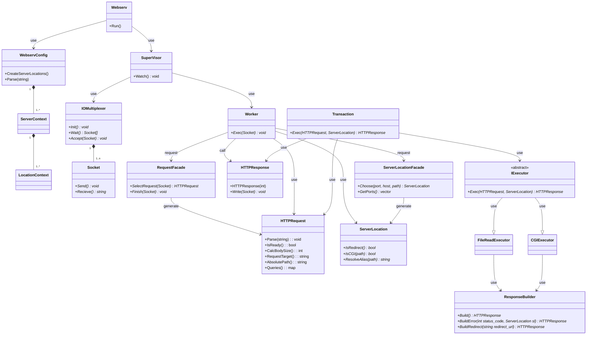

worker以降はなくて良い

```mermaid
classDiagram
    Webserv --> WebservConfig: use
    WebservConfig "1" *-- "1..*" ServerContext
    ServerContext "1" *-- "1..*" LocationContext

    Webserv --> SuperVisor: use

    IOMultiplexer "1" *-- "1..n" Socket
    SuperVisor --> IOMultiplexer: use
    SuperVisor --> Worker: use

    Worker --> RequestFacade: request
    RequestFacade --> HTTPRequest: generate
    Worker --> HTTPRequest: use
    Worker --> HTTPResponse: call
    Worker --> ServerLocationFacade: request
    Worker --> ServerLocation: use
    ServerLocationFacade --> ServerLocation: generate

    Transaction --> HTTPRequest: use
    Transaction --> HTTPResponse: use
    Transaction --> IExecutor: use
    IExecutor --|> FileReadExecutor: use
    IExecutor --|> CGIExecutor: use
    FileReadExecutor --> ResponseBuilder: use
    CGIExecutor --> ResponseBuilder: use

    %% ResponseBuilder --> HTTPResponse: use %%

    class WebservConfig {
        +CreateServerLocations()
        +Parse(string)
    }

    %% TODO: listenディレクトリは複数指定できるかを確認 %%
    %% TODO: redirectの持ち方を検討 %%
    class ServerContext {
    }

    class LocationContext {
    }

    class Webserv {
        +Run()
    }

    %% IO多重化とソケットクラスを生成してWorkerに処理を依頼するまでを担当する%%
    class SuperVisor {
        +Watch() void
    }

  class Socket {
    +Send()* void
    +Recieve()* string
  }

  class IOMultiplexer {
    +Init()* void
    +Wait()* Socket[]
    +Accept(Socket)* void
  }

  class Worker {
    +Exec(Socket)* void
  }

  class ServerLocationFacade {
    +Choose(port, host, path)* ServerLocation
    +GetPorts()* vector<string>
  }

  class ServerLocation {
    +IsRedirect()* bool
    +IsCGI(path)* bool
    +ResolveAlias(path)* string
  }

  class RequestFacade {
    +SelectRequest(Socket)* HTTPRequest
    +Finish(Socket)* void
  }

  class HTTPRequest {
    +Parse(string): void
    +IsReady(): bool
    +CalcBodySize(): int
    +RequestTarget(): string
    +AbsolutePath(): string
    +Queries(): map<string, string>
  }

  class HTTPResponse {
    +HTTPResponse(int)
    +Write(Socket)* void
  }

  class Transaction {
    +Exec(HTTPRequest, ServerLocation)* HTTPResponse
  }

  class IExecutor {
    <<abstract>>
    +Exec(HTTPRequest, ServerLocation)* HTTPResponse
  }

  class FileReadExecutor {
    
  }
  class CGIExecutor {

  }
  class ResponseBuilder {
    +Build()* HTTPResponse
    +BuildError(int status_code, ServerLocation sl)* HTTPResponse
    +BuildRedirect(string redirect_url)* HTTPResponse
  }

```
