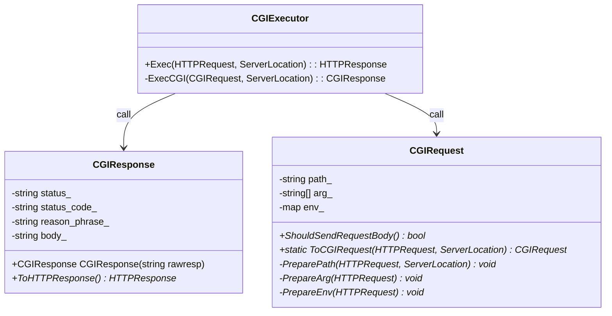

```mermaid
classDiagram
    CGIExecutor --> CGIResponse : call
    CGIExecutor --> CGIRequest : call

    class CGIRequest {
      +ShouldSendRequestBody()* bool
      +static ToCGIRequest(HTTPRequest, ServerLocation)* CGIRequest
      -string path_
      -string[] arg_
      -map<string, string> env_
      -PreparePath(HTTPRequest, ServerLocation)* void
      -PrepareArg(HTTPRequest)* void
      -PrepareEnv(HTTPRequest)* void
    }

    class CGIResponse {
      +CGIResponse CGIResponse(string rawresp)
      +ToHTTPResponse()* HTTPResponse
      -string status_
      -string status_code_
      -string reason_phrase_
      -string body_
    }

    class CGIExecutor {
      +Exec(HTTPRequest, ServerLocation) : HTTPResponse
      -ExecCGI(CGIRequest, ServerLocation) : CGIResponse
    }
```
