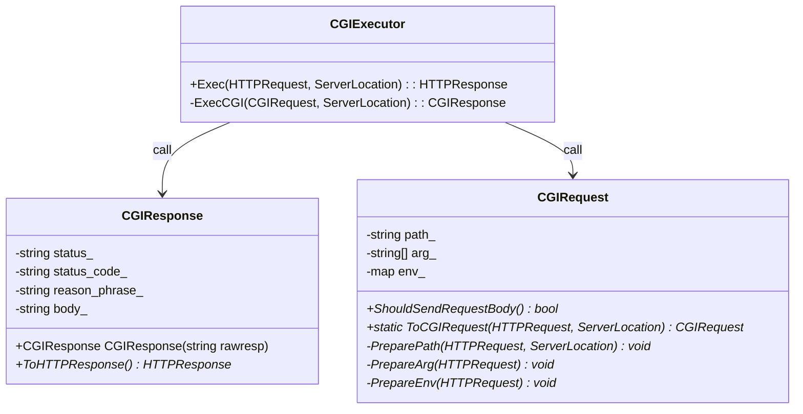

- 擬似コード

```cpp

class CGIRequest {
  public:
    bool ShouldSendRequestBody() {
      return "CONTENT_LENGTH" in env_
    }

    // 絶対パスを取得するためにServerLocationが必要
    static ToCGIRequest(HTTPRequest httpreq, ServerLocation sl) {
      // CGIプログラムの絶対パスをpath_に詰める
      PreparePath(httpreq, sl)
      // CGIプログラムに渡す引数をarg_に詰める
      PrepareArg(httpreq)
      // 環境変数をenv_に詰める
      PrepareEnv(httpreq)
    }

  private:
    string path_
    string[] arg_
    map<string, string> env_

    // URIをパースしてCGIプログラムの絶対パスを取得
    void PreparePath(HTTPRequest httpreq, ServerLocation sl) {}

    // URIに含まれているクエリをパースして引数を取得
    // ex. http://hoge/cgi-bin/somecgi?fuga+foo -> arg[] = {path_, "fuga", foo}
    // arg[0]には絶対パスを詰める
    void PrepareArg(HTTPRequest httpreq) {}

    void PrepareEnv(HTTPRequest httpreq) {
      env_["CONTENT_LENGTH"] = httpreq.content-length()
      env_["CONTENT_TYPE"] = httpreq.content-type()
      env_["PATH_INFO"] = GetPathInfoFromURI(httpreq.URI())
      env_["REQUEST_METHOD"] = httpreq.method()
      env_["SERVER_PROTOCOL"] = "HTTP/1.1"
    }
}

class CGIResponse {
  public:
    CGIResponse CGIResponse(string rawresp) {
      // rawrespにstringでCGIレスポンスの内容が入っているので、パースし取得
    }
    HTTPResponse ToHTTPResponse() {
      HTTPResponse ret

      ret.Setstatus_code(strtod(status_code_))
      ret.Setconnection("close")
      ret.Setallow("")
      ret.Setlocation("")
      ret.Setresponse_body(body_)
      return ret
    }

  public:
    string status_code_    // ex. 200
    string reason_phrase_  // ex. OK
    string body_
}

class CGIExecutor {
  public:
    HTTPResponse Exec(HTTPRequest httpreq, ServerLocation sl) {
      CGIRequest cgireq = CGIRequest::ToCGIRequest(httpreq, sl)

      CGIResponse cgires = ExecCGI(cgireq)
      return cgires.ToHTTPResponse()
    }

  private:
    // ミスってる, パイプ1本しかない
    CGIResponse ExecCGI(CGIRequest cgireq, ServerLocation sl) {
      pipe_to_cgi[2]  // CGIプログラム向きのパイプ
      pipe_to_serv[2] // サーバー向きのパイプ
      pipe(pipe_to_cgi)
      pipe(pipe_to_serv)

      if fork() == 0 {
        dup2(pipe_to_cgi[0], STDIN_FILENO)
        dup2(pipe_to_serv[1], STDOUT_FILENO)
        execve(cgireq.path(), cgireq.arg(), cgireq.env())
        close(rpipefdf)
        close(wpipefdf)
      }
      if cgireq.ShouldSendRequestBody() {
        Write(pipe_to_cgi[1], cgireq.body()) // Writeは適当に実装してください
      }
      close(pipe_to_cgi[1])
      int exit_status
      // TODO CGIプログラムがクラッシュ等で終了ステータス0以外で終了した時
      wait(&exit_status)
      string res = Read(pipe_to_serv[0]) // Readは適当に実装してください
      return CGIResponse(res)
    }
}

```
