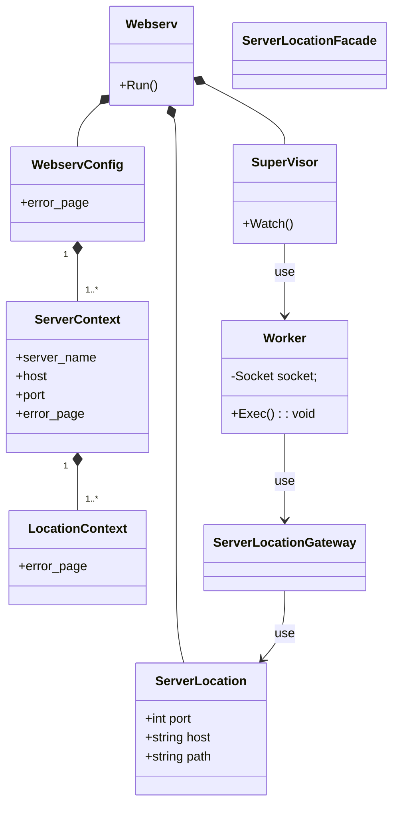

## idea
- WorkerがどのServerLocationを使うかのためにhostとportとpathの情報が必要
hostとpathはRequestを読まないと分からない。portはlisten_fdごとに判別するしかない？
Socketに持たせる必要があるかも。

## 擬似コード
```
SuperVisor {
fd_set mask;
fd_set copy_mask;

SuperVisor {
    // 待ち受けるソケットの分だけListenerを生成する
    Listener()
    // IO多重化の準備(maskの初期化)
}

// listend_fd
// socke_fd

void Watch() {
    Socket sockets[];
    while (1) {
        copy_mask = mask;
        select(copy_mask, ...);
        for(;) {
            if (IS_SET(listend_fd)) {
                Scoket *s = Listener.Accept();
                sockets.add(s);
            } else if (IS_SET(socke_fd)) {
                Worker w(s);
                w.Exec();
            }
        }
    }
}
}

Worker {
void Exec() {
    Request *reqeust = Request.Parse(Socket.read());
    ServerLocation sl = ServerLocationGateway.Choose(port, host, path);
    Reponse *reponse = Someone.Exec(request, sl);
    Socket.Write(response);
}
}
```

## メモ
- 実際の処理の実行とResponseを生成する部分。
- Watchの
