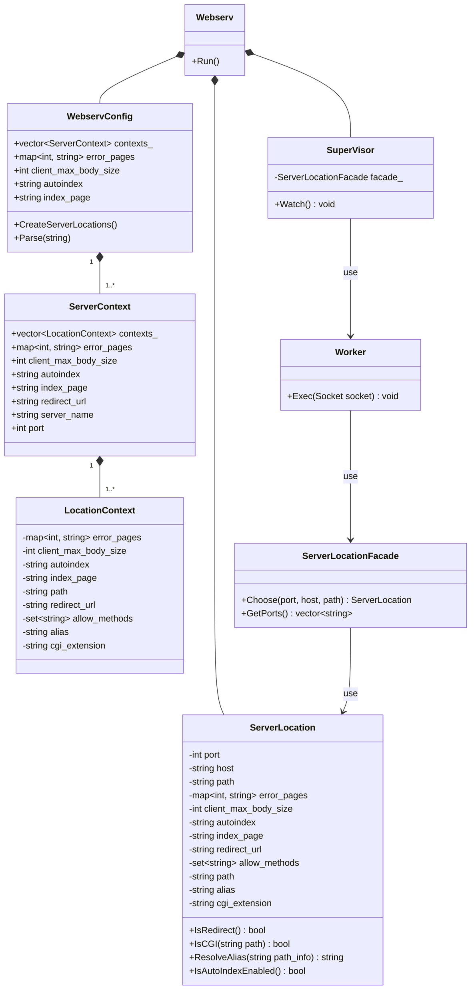

```mermaid
classDiagram
    Webserv *-- WebservConfig
    WebservConfig "1" *-- "1..*" ServerContext
    ServerContext "1" *-- "1..*" LocationContext

    Webserv *-- SuperVisor
    Webserv *-- ServerLocation
    SuperVisor --> Worker : use
    Worker --> ServerLocationFacade : use
    ServerLocationFacade --> ServerLocation: use

    class WebservConfig {
        +vector~ServerContext~ contexts_
        +map~int, string~ error_pages
        +int client_max_body_size
        +string autoindex
        +string index_page
        +CreateServerLocations()
        +Parse(string)
    }

    class ServerContext {
        +vector~LocationContext~ contexts_
        +map~int, string~ error_pages
        +int client_max_body_size
        +string autoindex
        +string index_page
        +string redirect_url
        +string server_name
        +int port
    }

    class LocationContext {
        -map~int, string~ error_pages
        -int client_max_body_size
        -string autoindex
        -string index_page
        -string path
        -string redirect_url
        -set~string~ allow_methods
        -string alias
        -string cgi_extension
    }

    class Webserv {
        +Run()
    }

    %% IO多重化とソケットクラスを生成してWorkerに処理を依頼するまでを担当する%%
    class SuperVisor {
        -ServerLocationFacade facade_
        +Watch() void
    }

    %% Socketを元に具体的な処理を担当する。 %%
    %% Requestを受け付けてResponseの返却をする %%
    class Worker {
        +Exec(Socket socket) void
    }

    %% どのServerLocationを使用するかを決定する責務 %%
    class ServerLocationFacade {
        +Choose(port, host, path) ServerLocation
        +GetPorts() vector~string~
    }

    %% configを元に各locationごとの設定 %%
    class ServerLocation {
        -int port
        -string host
        -string path
        -map~int, string~ error_pages
        -int client_max_body_size
        -string autoindex
        -string index_page
        -string redirect_url
        -set~string~ allow_methods
        -string path
        -string alias
        -string cgi_extension
        +IsRedirect() bool
        +IsCGI(string path) bool
        +ResolveAlias(string path_info) string
        +IsAutoIndexEnabled() bool
    }
```
