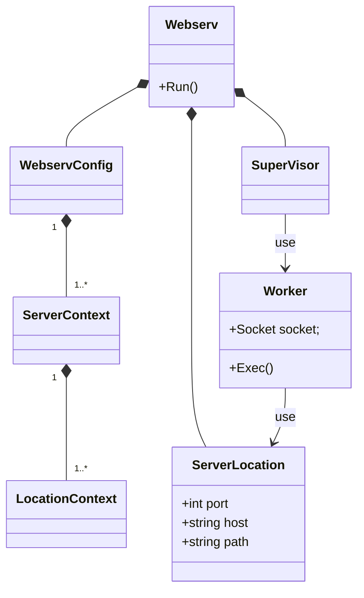
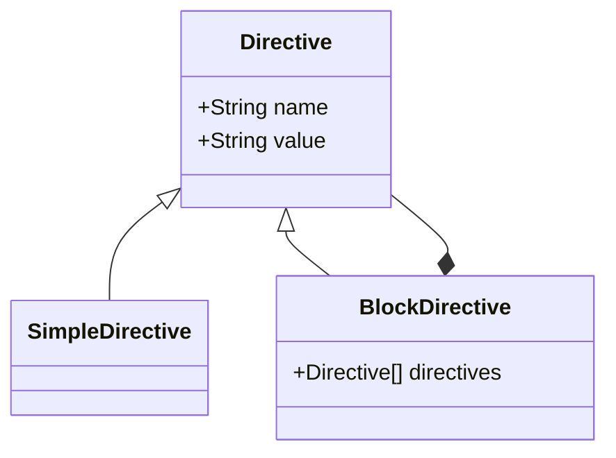

```mermaid
classDiagram
    Webserv *-- WebservConfig
    WebservConfig "1" *-- "1..*" ServerContext
    ServerContext "1" *-- "1..*" LocationContext

    Webserv *-- SuperVisor
    Webserv *-- ServerLocation
    SuperVisor --> Worker : use
    Worker --> ServerLocation : use

    class Webserv {
        +Run()
    }

    class SuperVisor {

    }

    class Worker {
        +Socket socket;
        +Exec()
    }

    class ServerLocation {
        +int port
        +string host
        +string path
    }
```

```mermaid
classDiagram
    Directive <|-- SimpleDirective
    Directive <|-- BlockDirective
    BlockDirective *-- Directive

    class Directive {
        +String name
        +String value
    }

    class BlockDirective {
        +Directive[] directives
    }
```

## idea
- 単一ディレクティブもクラスで表現する？
- configクラスを生成するためにレキサーとパーサーを実装する必要がある？
- トークン用のクラスも必要？