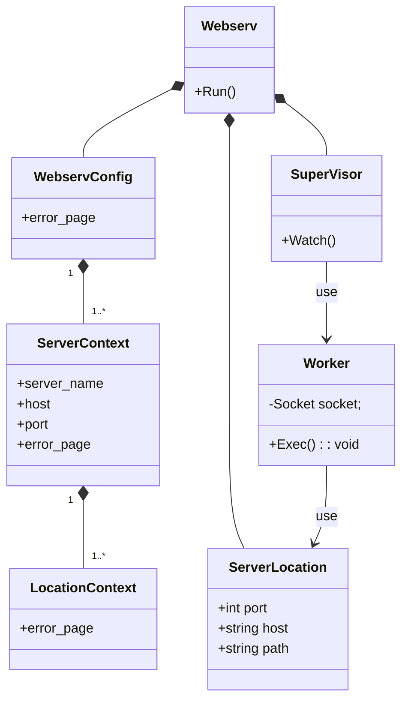

## idea
- WorkerがどのServerLocationを使うかのためにhostとportとpathの情報が必要
hostとpathはRequestを読まないと分からない。portはlisten_fdごとに判別するしかない？
Socketに持たせる必要があるかも。

## 擬似コード
```
SuperVisor {

SuperVisor {
    Socket.Listen();
    IO多重化の準備
}

void Watch() {
    while (1) {
        Scoket *s = Sokcet.Accept();
        Worker w(s);
        w.Exec();
    }
}

}

Worker {
void Exec() {
    Request *reqeust = Request.Parse(Socket.read());
    ServerLocation sl = ServerLocationGateway.Choose(port, host, path);
    Reponset *reponse = Someone.Exec(request, sl);
    Socket.Write(response);
}
}
```
