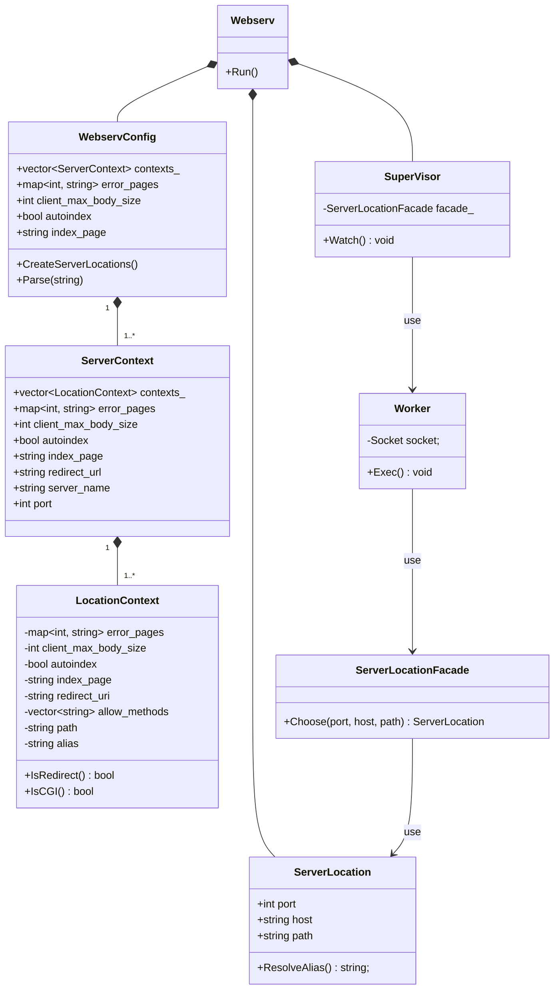

## 擬似コード

```cpp
Webserv {
    // IDEA: 別途Lexer&Parserの責務を持ったクラスを定義しても良いかもしれない。
    void Run() {
        WebservConfig config = WebservConfig.Parse();
        vector<ServerLocation> locations = config.CreateServerLocations();
        ServerLocationFacade facade(locations);
        SuperVisor sv(facade);
        sv.Watch();
    }
};

// ソケット周りのクラスが固まっていないので雰囲気で書いている。
SuperVisor {
    // Constructorでやる？
    void Setup() {
        // 待ち受けるポートの数だけlisten fdを用意する
        Acceptor.CreateListner();
    }

    void Watch() {
        while (1) {
            vector<Socket> sockets = Acceptor.Select();
            for (socket in sockets) {
                if (socket.isListner()) {
                    // acceptしてfdを生成してselectの対象にする
                    Acceptor.AddListner(socket);
                } else {
                    Worker w(socket);
                    w.Exec();
                }
            }
        }
    }
};

Woker {
    void Exec() {
        Request request = Request.Parse(socket_);
        ServerLocation sl = facade_.Choose(port, host, path);
        Response response = Someone.Exec(request, sl);
        Response.Write(socket_);
    }
};
```

## メモ

- ServerLocationはServerとLocationに分けたほうがいい可能性もある。
- WorkerがどのServerLocationを使うかを判別するためにhost, port, pathの3つが必要。
- hostとpathはRequestを読まないと分からない。portについてはlisten_fdごとに判別するしかないかもしれない。
