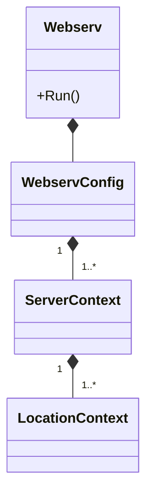
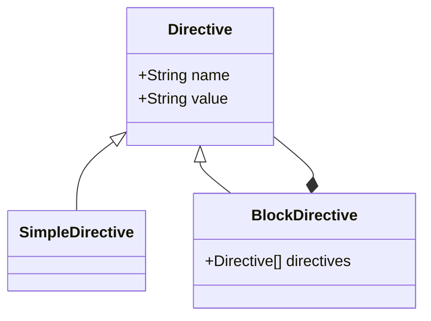

```mermaid
classDiagram
    Webserv *-- WebservConfig
    WebservConfig "1" *-- "1..*" ServerContext
    ServerContext "1" *-- "1..*" LocationContext

    class Webserv {
        +Run()
    }
```

```mermaid
classDiagram
    Directive <|-- SimpleDirective
    Directive <|-- BlockDirective
    BlockDirective *-- Directive

    class Directive {
        +String name
        +String value
    }

    class BlockDirective {
        +Directive[] directives
    }
```

## idea
- 単一ディレクティブもクラスで表現する？
- configクラスを生成するためにレキサーとパーサーを実装する必要がある？
- トークン用のクラスも必要？