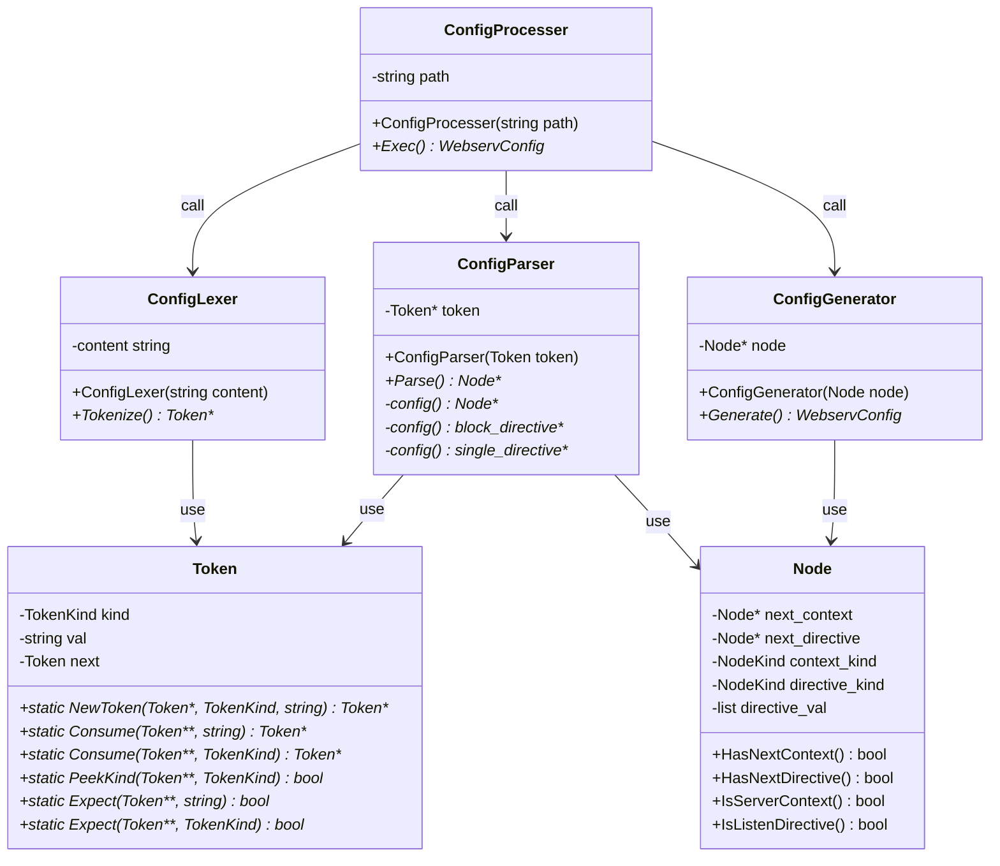

## TokenKindについて

| kind名                | 説明                   |
| -------------------- | -------------------- |
| BlockDirectiveToken  | "server"             |
| SingleDirectiveToken | "listen"とか           |
| OpenBracketToken     | "{"                  |
| CloseBracketToken    | "}"                  |
| SemicolonToken       | ";"                  |
| ValueToken           | "80"とか"www.hoge.com" |

## NodeKindの種類

| kind名               | 説明              |
| ------------------- | --------------- |
| ServerContextNode   | "server"コンテキスト  |
| ListenDirectiveNode | "listen"ディレクティブ |

## Configファイルの文法

- パーサーはこの文法に従い、構文解析していく

```
config           ::= block_directive
block_directive  ::= "server" [value] "{" single_directive "}"
single_directive ::= "listen" value ";"
value            ::= (英数字 | ".")+
```

## 擬似コード

```cpp

class ConfigLexer {
  public:
    // 字句解析する対象のコンテンツを受け取る
    ConfigLexer(string content)

    // 字句解析を行いトークンを得る
    Token Tokenize() {
      for(;;) {
        SkipWhiteSpaces() // SPとかNLをスキップ
        if keyword is "server" {
          MakeServerToken()
          UpdateToken()
          continue
        }
        if keyword is "{" {
          MakeOpenBracketToken()
          UpdateToken()
          continue
        }
        if keyword is "}" {
          MakeCloseBracketToken()
          UpdateToken()
          continue
        }
        // 不適切なキーワードはエラー
        throw UnknownKeyword()
      }
    }

  private:
    string content
}

class ConfigParser {
  public:
    // 構文解析する対象のトークンを受け取る
    ConfigParser(Token token)

    // 構文解析を行い、トークンを別のデータ構造に変換しつつ構文チェックを行う
    void Parse() {
      node = config()
    }

  private:
    Token token

    Node block_directive() {
      if (token.Expect("server")) {
        MakeServerNode()
        UpdateServerNode()
        if (token.Expect("{")) {
          throw NeedOpenBracket()
        }
        node = single_directive()
        if (token.Expect("}")) {
          throw NeedOpenBracket()
        }
        return node
      }
      throw hoge()
    }

    Node config() {
      return block_directive()
    }
}

class ConfigGenerator {
  public:
    // WebservConfigに詰めるノードを受け取る
    ConfigGenerator(Node node)

    // ノードを辿り、WebservConfigを作成する
    WebservConfig Generate() {
      WebservConfig conf

      for (node is not end_node) {
          if (next_context is server) {
            ServerContext servcontext = MakeServerContext() // 再帰的にnodeを辿り、ディレクティブやlocationが見つかったら適切に処理してLocationContextを作成し、ServerContextに詰める
            LetHaveServerContext(conf, servcontext)
          }
          // エラー
          throw UnknownContext()
      }

      return conf
    }
  private:
    Node node
}

class ConfigProcesser {
  public:
    // configファイルのパスを受け取る
    ConfigProcesser(string path)

    // configファイルを解釈してWebservConfigを生成
    WebservConfig Exec() {
      content = ReadFile(path)
      ConfigLexer lexer(content)
      Token token = lexer.Tokenize()
      ConfigParser parser(token)
      Node node = parser.Parse()
      ConfigGenerator generator(node)
      return generator.Generate()
    }

  private:
    // configファイルのパス
    string path
}

class Token {
  public:
    // 次のトークンに進む。
    void Consume()

    // 次のトークンを返す。トークンは進めない
    Token Peek()

    // 次のトークンが期待されるトークンかを判定する
    // 期待されるトークンだと次に進む
    bool Expect(string expect_val)

  private:
    TokenKind kind
    string val
    Token next
}

class Node {
  public:

  private:
    // いま見ているコンテキストが持つコンテキスト
    Node next_context

    // いま見ているコンテキストが持つディレクティブ
    Node next_directive

    // いま見ているコンテキストの種類
    NodeKind context_kind

    // いま見ているディレクティブの種類
    NodeKind directive_kind

    // いま見ているディレクティブの値
    list<string> directive_val
}

```
