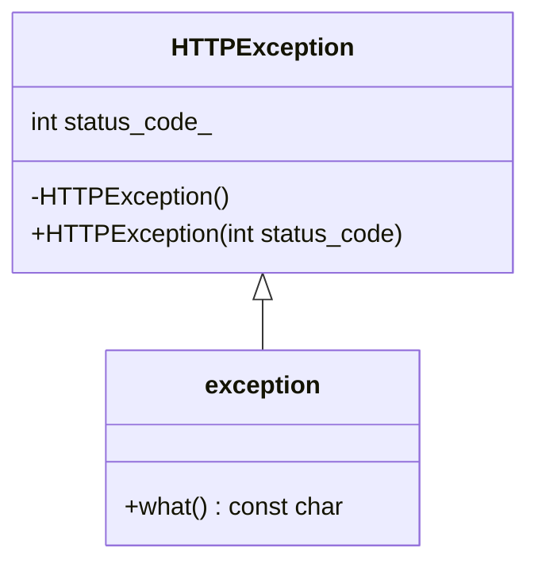

# exception

## クラス図



## 擬似コード

```cpp
#include <exception>

// HTTPのRFCで規定されている例外を管理するので、HTTPException
class HTTPException : public std::exception {
    public:
     HTTPException() throw();
     HTTPException(int status_code) throw(){
        status_code_ = status_code;
        };
     virtual const char* what() const throw();
     int status_code();

    private:
     int status_code_;
}

class Transaction {
    HTTPResponse Exec(HTTPRequest req, ServerLocation sl) {
        try {
            if (req.method() not in sl.allowed_method()) {
                throw HTTPException(403); // ステータスコードを設定。
            }
            if (req.CalcBodySize() > sl.client_max_body_size) {
                throw HTTPException(413); // ステータスコードを設定。
            }
            if (req.method() == "GET") {
                return FileReadExecutor(req, sl);
            }
        } catch (HTTPException &e) {
            return ResponseBuilder.BuildError(e->status_code(), sl);
        } catch (...) {
            return ResponseBuilder.BuildError(500, sl); // その他エラーは500にする。
        }
    }
}
```
