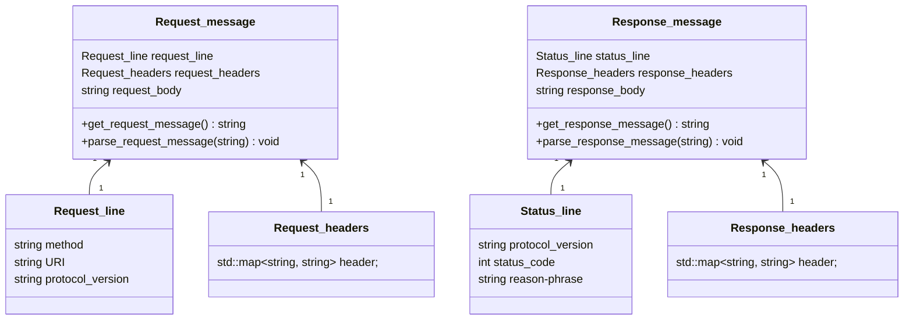

```mermaid
classDiagram
   class Request_message{
    Request_line request_line
    Request_headers request_headers
    string request_body
    +get_request_message() string
    +parse_request_message(string) void
    }

   class Request_line{
    string method
    string URI
    string protocol_version
    }

   class Request_headers{
    std::map~string, string~ header;
    }

    class Response_message{
    Status_line status_line
    Response_headers response_headers
    string response_body
    +get_response_message() string
    +parse_response_message(string) void
    }

   class Status_line{
    string protocol_version
    int status_code
    string  reason-phrase
    }

   class Response_headers{
    std::map~string, string~ header;
    }

Request_message "1" <-- "1" Request_line
Request_message "1" <-- "1" Request_headers


Response_message "1" <-- "1" Status_line
Response_message "1" <-- "1" Response_headers

```
