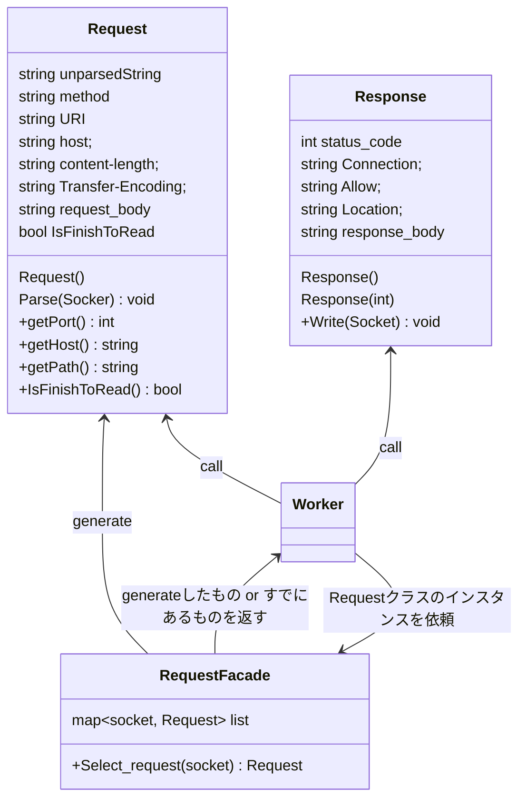

## 擬似コード

```cpp
/*
requestを選択するためのFacade.
Requestの途中でrcve終了→再度epoll→途中から継続して読み込みののちに処理を開始するための仕組み。
*/
RequestFacade{
    private:
        map<socket, Request> list
    Request select_request(socket)
    {
        if (list not in socket)
            list[socket] = new Request;
        return list[socket];
    };
}
Request{
    request(){
        unparsedString = "";
        finish_to_read_header = false;
    }

    //他チームのアドバイスを参考に追加
    Parse(string str){
        str = unparsedString + str;
        if (not finish_to_read_header)
        {
            if ("\n\n" is in str)
            {
                str = parse_header(str);//body部分をstrとして返す。
                finish_to_read_header = true;
            }
        }
        if (finish_to_read_header)
        {
            if (str.size() == content-length)
            {
                parse_body(str)
            } 
            else if (transfer-encoding = 'chunked' && str is in 最後のチャンク)
            {
                str = unchunk(str)
                parse_body(str)
            }
            else
            {
                unparsedString = str
            }

        }


    }
}

Worker {
    Worker(){
        RequestFacade RequestFacade = new RequestFacade()
    }

    void Exec(socket) {
        Request& request  = RequestFacade(socket_)
        try {
            string str = socket.read();
            request.Parse(str);

            if (request.IsFinishToRead())
            {
                ServerLocation sl = facade_.Choose(request.get_port(), request.get_host(), request.get_path());

                //案１
                Response response = exec_request_and_ResponseBuilder.Exec(request_message, sl);

                //案２
                ExecConclustion conclusion = exec_requst.exec(request_message, sl);
                Response response = ResponseBuilder.build(conclusion);

                Response.Write(socket_), ;
                RequestFacade.finish(socket_);
                socket.should_close_socket = true;
            }
        }
        catch(400 error的な)
        {
            Response response = new response(400);
            Response.Write(socket_), ;
            RequestFacade.finish(socket_);
            socket.should_close_socket = true;
        }
        catch(500 error的な)
        {
            Response response = new response(500);
            Response.Write(socket_), ;
            RequestFacade.finish(socket_);
            socket.should_close_socket = true;
        }
        ...
    }
};
```
