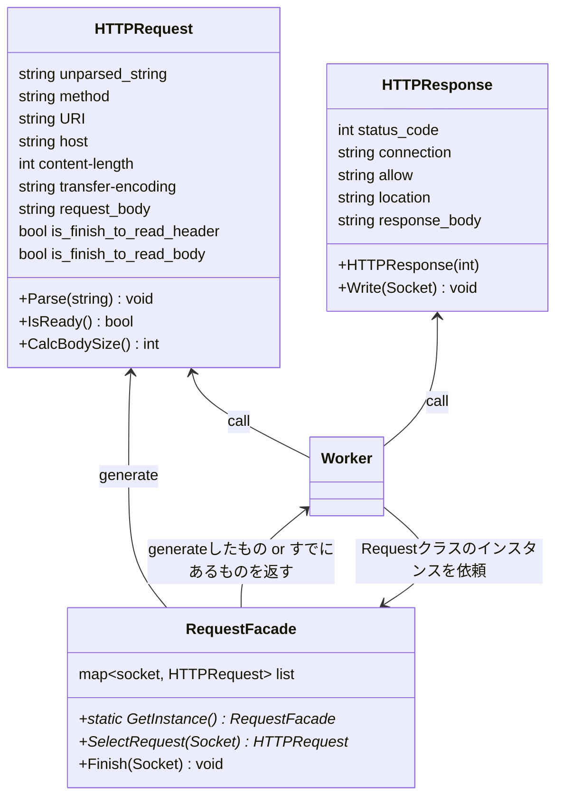

## 擬似コード

```cpp
/*
requestを選択するためのFacade.
Requestの途中でrcve終了→再度epoll→途中から継続して読み込みののちに処理を開始するための仕組み。
*/
RequestFacade{
    private:
        map<socket, HTTPRequest> list
    HTTPRequest select_request(socket)
    {
        if (list not in socket)
            list[socket] = new HTTPRequest;
        return list[socket];
    };
}
HTTPRequest{
    request(){
        unparsed_string = "";
        IsFinishToReadHeader = false;
        IsReady = false;
    }

    //他チームのアドバイスを参考に追加
    Parse(string str){
        str = unparsed_string + str;
        if (not IsFinishToReadHeader)
        {
            if ("\n\n" is in str)
            {
                header, body = split(str, "\n\n")
                ParseHeader(header);
                unparsed_string = body
                IsFinishToReadHeader = true;
            }
        }
        if (IsFinishToReadHeader)
        {
            if (str.size() >= content-length)
            {
                ParseBody(str)
                IsReady = true; 
            } 
            else if (transfer-encoding = 'chunked' && str is in 最後のチャンク)
            {
                str = unchunk(str)
                ParseBody(str)
                IsReady = true; 
            }
            else if (ヘッダーだけ)
            {
                IsReady = true; 
            } 
            else
            }
            {
                unparsed_string += str
            }
        }
    }
}

Worker {
    Worker(){
        RequestFacade RequestFacade = new RequestFacade()
    }

    void Exec(socket) {
        HTTPRequest& request  = RequestFacade(socket_)
        try {
            string str = socket.read();
            request.Parse(str);

            if (request.IsReady())
            {
                ServerLocation sl = server_location_facade_.Choose(request.get_port(), request.get_host(), request.get_path());

                HTTPResponse response = Transaction.Exec(request, sl);

                HTTPResponse.Write(socket_);
                RequestFacade.Finish(socket_);
                socket.should_close_socket = true;
            }
        }
        catch(400 error的な)
        {
            HTTPResponse response = new response(400);
            HTTPResponse.Write(socket_), ;
            RequestFacade.Finish(socket_);
            socket.should_close_socket = true;
        }
        catch(500 error的な)
        {
            HTTPResponse response = new response(500);
            HTTPResponse.Write(socket_), ;
            RequestFacade.Finish(socket_);
            socket.should_close_socket = true;
        }
        ...
    }
};
```
