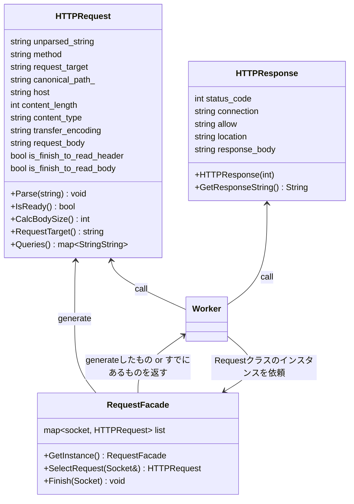

```mermaid
classDiagram
   class RequestFacade{
        map~socket, HTTPRequest~ list
        +GetInstance() RequestFacade
        +SelectRequest(Socket&) HTTPRequest
        +Finish(Socket) void
    }

    class HTTPRequest{
        string unparsed_string
        string method
        string request_target
        string canonical_path_
        string host
        int content_length
        string content_type
        string transfer_encoding
        string request_body
        bool is_finish_to_read_header
        bool is_finish_to_read_body
        
        +Parse(string) void
        +IsReady() bool
        +CalcBodySize() int
        +RequestTarget() string
        +Queries() map~StringString~
    }

    class HTTPResponse{
        int status_code
        string connection
        string allow
        string location
        string response_body

        +HTTPResponse(int)
        +GetResponseString() String
    }


HTTPRequest <-- RequestFacade : generate

Worker <-- RequestFacade : generateしたもの or すでにあるものを返す
Worker --> RequestFacade : Requestクラスのインスタンスを依頼


HTTPRequest  <--  Worker :call
HTTPResponse  <--  Worker :call
```
