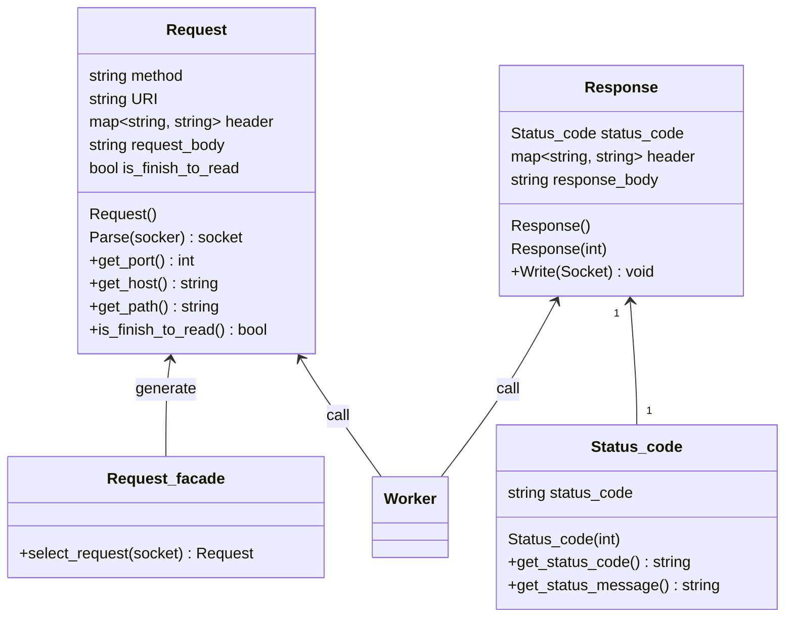

## 擬似コード

```cpp
/*
requestを選択するためのFacade.
Requestの途中でrcve終了→再度epoll→途中から継続して読み込みののちに処理を開始するための仕組み。
*/
Request_Facade{
    Request select_request(socket){};
}

Worker {
    Worker(){
        Request_facade request_facade = new Request_facade()
    }

    void Exec() {
        for socket in socket_list
        {
            if (accept){

            }
            else
            {
                Request request  = request_facade(socket_)
                try {
                    request.Parse(socket_);

                    if (request.is_finish_to_read())
                    {
                        ServerLocation sl = facade_.Choose(request.get_port(), request.get_host(), request.get_path());

                        Response response = Someone.Exec(request_message, sl);
                        Response.Write(socket_), ;
                    }
                }
                catch(400 error的な)
                {
                    Response response = new response(400);
                    Response.Write(socket_), ;
                }
                catch(500 error的な)
                {
                    Response response = new response(500);
                    Response.Write(socket_), ;
                }
                ...


            }
        }
    }
};
```
