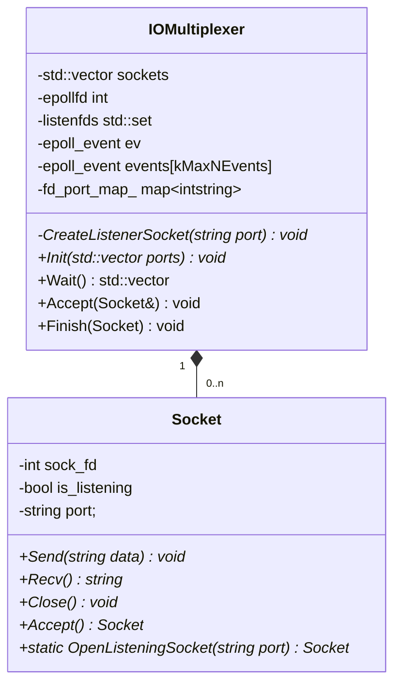

- Class 図

```mermaid
classDiagram
  IOMultiplexer "1" *-- "0..n" Socket

  class Socket {
    -int sock_fd
    -bool is_listening
    -string port;
    +Send(string data)* void
    +Recv()* string
    +Close()* void
    +Accept()* Socket
    +static OpenListeningSocket(string port)* Socket
  }

  class IOMultiplexer {
    -std::vector<Socket> sockets
    -epollfd int
    -listenfds std::set<int>
    -epoll_event ev
    -epoll_event events[kMaxNEvents]
    -fd_port_map_ map~intstring~
    -CreateListenerSocket(string port)* void
    +Init(std::vector<std::string> ports)* void
    +Wait() std::vector<Socket*>
    +Accept(Socket&) void
    +Finish(Socket) void
  }

```
