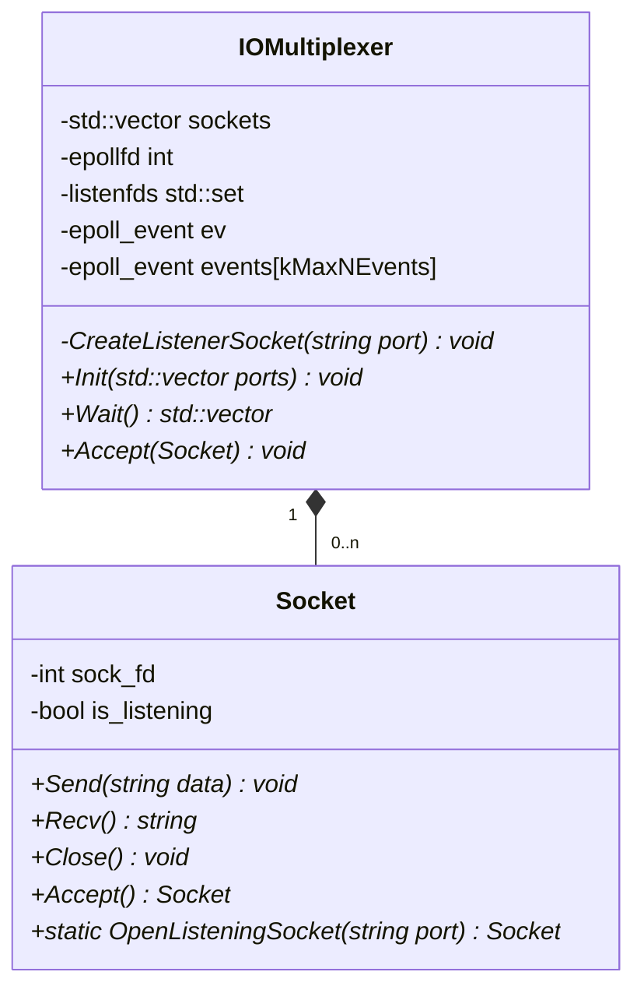

- Class 図



- 疑似コード

```cpp

class Socket {
  private:
      int  sock_fd
      bool is_listening

  public:
      // Responseを受け取りソケットに書き込む
      void Send(string)

      // ソケットを読み込み、何かしらのデータとして返す
      string Recv()

      // ソケットをクローズ
      void Close()

      // クライアントからの接続を受け付けて、新しくソケットを生成
      Socket Accept()

      // リッスン状態のソケットを生成
      static Socket OpenListeningSocket(string port)
}

// I/O多重化の処理をやってくれるやつ
class IOMultiplexer {
    private:
        // ソケット群
        std::vector<Socket> sockets

        // listenソケット群
        std::set<int> listenfds

        // リッスン状態のソケットを生成
        CreateListenerSocket(string port)

        // epoll固有の変数は省略
        ...

    public:
        // socket群を初期化するやつ
        void Init(std::vector<std::string> ports) {
            for port in ports {
                CreateListenerSocket(port)
            }
            ... // epoll固有の実装なので省略
        }

        // ソケット群がready状態になるまで待機
        std::vector<Socket> Wait() {
          ... // epoll固有の実装なので省略
        }

        // listen状態のソケットを受け取り、acceptして新しいクライアントとのソケットをソケット群に追加
        void Accept(Socket listener) {
          Socket client = listener.Accept()
          ... // epoll固有の実装なので省略
          sockets.push_back(client)
        }
}

// Socket、IOMultiplexerの使い方について記述するためSuperVisorの擬似コードを記載
class SuperVisor {
    private:
        ServerLocationFacade facade

    public:
        void Watch() {
            IOMultiplexer iomul
            string[] port_list = ServerLocationFacade.Getpostlist()
            iomul.Init(port_list)
            while (1) {
                Socket[] sockets = iomul.Wait()
                for socket in sockets {
                    if socket.is_listening()
                        iomul.Accept(socket)
                    else
                        Worker.Exec(socket)
                }
            }
        }
}

```
