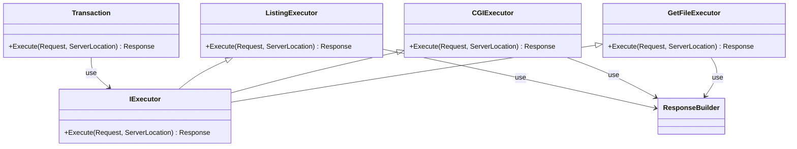

```cpp
 void Exec(socket) {
        Request& request  = RequestFacade(socket_)
        try {
            string str = socket.read();
            request.Parse(str);

            if (request.IsReady())
            {
                ServerLocation sl = facade_.Choose(request.get_port(), request.get_host(), request.get_path());

                Result response = Transaction.Exec(request, sl);

                Response.Write(socket_);
                RequestFacade.Finish(socket_);
                socket.should_close_socket = true;
            }
        }

class Transaction {
    Result Exec(request, sl) {
        if (redirect) {
            return Result.Redirect(request, sl);
        }
        if (hogehoge) {
            return GetFileExecutor(request, sl);
        } else if (
            return CGIExecutor(request, sl);
        ) else if {
            return ListingExecutor(request, sl);
        }
    }
}
```
