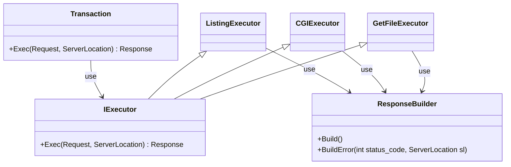

```cpp
Transaction {
    Response Exec(Request req, ServerLocation sl) {
		try {
			if (req.method not in sl.allowed_method) {
				throw IExecutor::MethodNotAllowed();
			}
			if (req.CalcBodySize() > sl.client_max_body_size) {
				throw IExecutor::PayloadTooLarge();
			}
			if (sl.redirect()) {
				return Result.Redirect(sl.redirect());
			}
			if (sl.autoindex) {
				return ListingExecutor(req, sl);
			} else if (req.GET) {
				return GetFileExecutor(req, sl);
			} else if (sl.cgi()) {
				return CGIExecutor(req, sl);
			}
		} catch (IExecutor::ExecutorException &e) {
			return ResponseBuilder.BuildError(e->status_code, sl);
		} catch (std::exception &e) {
			return ResponseBuilder.BuildError(500, sl);
		}
    }
};

GetFileExecutor {
  Response Exec(Request req, ServerLocation sl) {
    string data = read(path);
    return ResponseBuilder.Build(data);
  }
};

CGIExecutor {
  Response Exec(Request req, ServerLocation sl) {
    // setenv
    // fork
    string data = read(pipe_fd);
    return ResponseBuilder.Build(data);
  }
};

ListingExecutor {
  Response Exec(Request req, ServerLocation sl) {
    files = getfiles();
    return ResponseBuilder.Build(files);
  }
};
```
