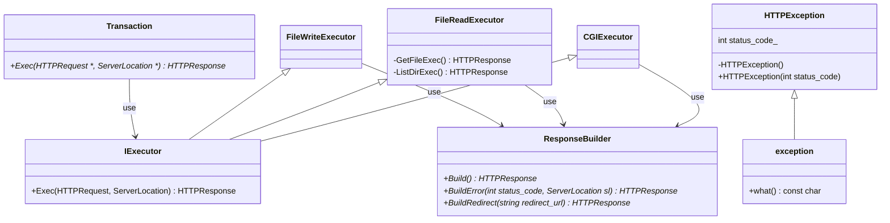

# Transaction

```mermaid
classDiagram
    CGIExecutor <|-- IExecutor
    FileReadExecutor <|-- IExecutor
    FileWriteExecutor <|-- IExecutor

    Transaction --> IExecutor : use
    CGIExecutor --> ResponseBuilder : use
    FileReadExecutor --> ResponseBuilder : use
    FileWriteExecutor --> ResponseBuilder : use

    HTTPException <|-- exception

    class FileReadExecutor {
        -GetFileExec() HTTPResponse
        -ListDirExec() HTTPResponse
    }

    class FileWriteExecutor {
    }

    class CGIExecutor {
    }

    class IExecutor {
        +Exec(HTTPRequest, ServerLocation) HTTPResponse
    }


    class Transaction {
        +Exec(HTTPRequest *, ServerLocation *) HTTPResponse*
    }

    %% status_code, server_location &&
    class ResponseBuilder {
        +Build() HTTPResponse*
        +BuildError(int status_code, ServerLocation sl) HTTPResponse*
        +BuildRedirect(string redirect_url) HTTPResponse*
    }

    class exception{
        +what() const char
    }

    class HTTPException{
        int status_code_
        -HTTPException()
        +HTTPException(int status_code)
    }

```
