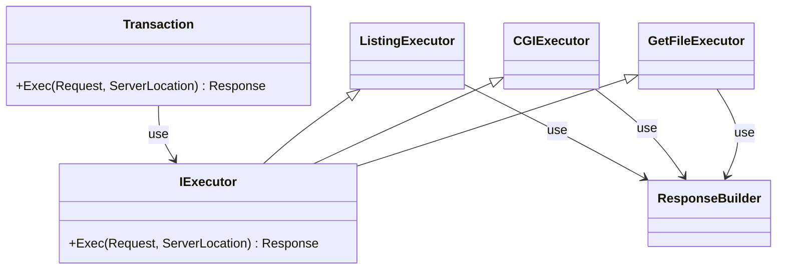

```cpp

Transaction {
    Response Exec(Request req, ServerLocation sl) {
        if (sl.redirect()) {
          return Result.Redirect(sl.redirect());
        }
        if (sl.autoindex) {
          return ListingExecutor(req, sl);
        } else if (req.GET) {
          return GetFileExecutor(req, sl);
        } else if (sl.cgi()) {
          return CGIExecutor(req, sl);
        }
    }
};

GetFileExecutor {
  Response Exec(Request req, ServerLocation sl) {
    string data = read(path);
    return ResponseBuilder(data);
  }
};

CGIExecutor {
  Response Exec(Request req, ServerLocation sl) {
    // setenv
    // fork
    string data = read(pipe_fd);
    return ResponseBuilder(data);
  }
};

ListingExecutor {
  Response Exec(Request req, ServerLocation sl) {
    files = getfiles();
    return ResponseBuilder(files);
  }
};
```
