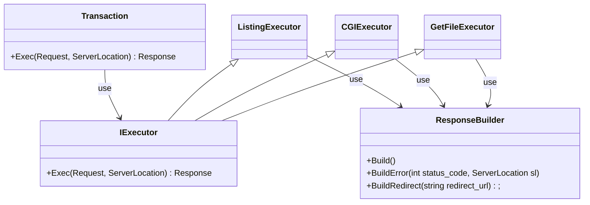

```cpp
Transaction {
    Response Exec(Request req, ServerLocation sl) {
		try {
			if (req.method not in sl.allowed_method) {
				throw IExecutor::MethodNotAllowed();
			}
			if (req.CalcBodySize() > sl.client_max_body_size) {
				throw IExecutor::PayloadTooLarge();
			}
			if (sl.IsRedirect()) {
				return ResponseBuilder.BuildRedirect(sl.redirect_uri());
			}
			if (sl.IsCGI()) {
				return CGIExecutor(req, sl);
			}
			string alias_resolved_uri = ServerLocation.ResolveAlias(req);
			// TODO: CGIプログラム以外にPOST, DELETEが来た場合はどうなる？
			if (req.method is POST or DELETE) {
				throw IExecutor::SomeException();
			}
			// IDEA: 後続の処理はTransactionからGetFileExecutor, ListingExecutorに振り分けているがGetExecutorに統一してもいいかもしれない。
			if (req.url is not Exist) {
				throw IExecutor::NotFound();
			}
			if (req.uri is regular file) {
				return GetFileExecutor(req, sl);
			}
			// TODO: autoindex, index周りの挙動を確認
			if (sl.IsIndex() {
				if ((req.url + sl.index() is not Exist)) {
					throw IExecutor::NotFound();
				} else {
					return GetFileExecutor(req, req.url + sl.index());
				}
			}
			if (sl.autoindex()) {
				return ListingExecutor(req, sl);
			} else {
				// TODO: autoindex offの場合を確認
				throw IExecutor::NotFound();
			}
		} catch (IExecutor::ExecutorException &e) {
			return ResponseBuilder.BuildError(e->status_code, sl);
		} catch (std::exception &e) {
			return ResponseBuilder.BuildError(500, sl);
		}
    }
};

GetFileExecutor {
  Response Exec(Request req, ServerLocation sl) {
    string data = read(path);
    return ResponseBuilder.Build(data);
  }
};

CGIExecutor {
  Response Exec(Request req, ServerLocation sl) {
    // setenv
    // fork
    string data = read(pipe_fd);
    return ResponseBuilder.Build(data);
  }
};

ListingExecutor {
  Response Exec(Request req, ServerLocation sl) {
    files = getfiles();
    return ResponseBuilder.Build(files);
  }
};

ResponseBuilder {
	Response Build(string body) {
		return new Response();
	}

	Response BuildError(int status_code, ServerLocation sl) {
		if (status_code in sl.error_pages) {
			// 設定されているエラーページを返す
			// TODO: 設定されているエラーページがない場合の挙動は要確認
		} else {
			// デフォルトのエラーページを返す
		}
		return new Response();
	}

	Response BuildRedirect(string redirect_uri) {
		// locationにredirect_urlを設定
		// status_codeは302
		// TODO: これとerror_pageで302が設定されていた場合
	}
}
```
