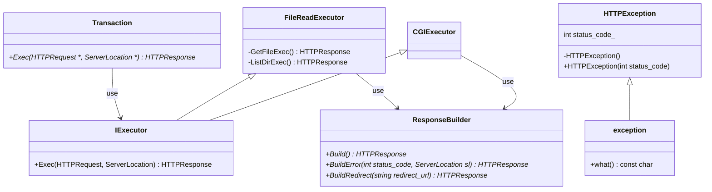

# Transaction



```cpp
class Transaction {
    HTTPResponse Exec(HTTPRequest req, ServerLocation sl) {
        try {
            if (req.method not in sl.allowed_method) {
                throw HTTPException(405);
            }
            if (req.CalcBodySize() > sl.client_max_body_size) {
                throw HTTPException(413);
            }
            if (sl.IsRedirect()) {
                return ResponseBuilder.BuildRedirect(sl.redirect_url());
            }
            if (sl.IsCGI()) {
                return CGIExecutor(req, sl);
            }
            string alias_resolved_uri = ServerLocation.ResolveAlias(req.uri());
            if (sl.IsCGI()) {
                return FileExecExecutor(req, sl);
            }
            if (req.method == "GET") {
                return FileReadExecutor(req, sl);
            }
            // TODO: CGIプログラム以外にPOST, DELETEが来た場合はどうなる？
            if (req.method is in[POST, DELETE]) {
                throw HTTPException(XXX);
                //もしくは    return FileWriteExecutor(req, sl);
            }
        } catch (HTTPException &e) {
            return ResponseBuilder.BuildError(e->status_code(), sl);
        } catch (...) {
            return ResponseBuilder.BuildError(500, sl); // その他エラーは500にする。
        }
    } 
}

class FileReadExecutor{
 HTTPResponse Exec(HTTPRequest req, ServerLocation sl){
    if (req.url is not Exist) {
      throw HTTPException(404);
    }
 }
    if (req.uri is regular file) {
      return GetFileExecutor(req, sl);
    }
   // TODO: autoindex, index周りの挙動を確認
    if (sl.IsIndex() {
      if ((req.url + sl.index() is not Exist)) {
        throw HTTPException(404);
      } else {
        return GetFileExecutor(req, req.url + sl.index());
      }
    }
    if (sl.autoindex()) {
      return ListingExecutor(req, sl);
    } else {
      // TODO: autoindex offの場合を確認
      throw HTTPException(404);
    }

    private:
        HTTPResponse GetFileExec(HTTPRequest req, ServerLocation sl) {
            string data = read(path);
            return ResponseBuilder.Build(data);
        };
        HTTPResponse ListingExec(HTTPRequest req, ServerLocation sl) {
            files = getfiles();
            return ResponseBuilder.Build(files);
        };
}

CGIExecutor {
  HTTPResponse Exec(HTTPRequest req, ServerLocation sl) {
    // setenv
    // fork
    string data = read(pipe_fd);
    return ResponseBuilder.Build(data);
  }
};

ResponseBuilder {
    HTTPResponse Build(string body) {
        return new HTTPResponse();
    }
    HTTPResponse BuildError(int status_code, ServerLocation sl) {
        if (status_code in sl.error_pages) {
            // 設定されているエラーページを返す
            // TODO: 設定されているエラーページがない場合の挙動は要確認
        } else {
            // デフォルトのエラーページを返す
        }
        return new HTTPResponse();
    }
    HTTPResponse BuildRedirect(string redirect_url) {
        // locationにredirect_urlを設定
        // status_codeは302
        // TODO: これとerror_pageで302が設定されていた場合
    }
}

// HTTPのRFCで規定されている例外を管理するので、HTTPException
class HTTPException : public std::exception {
    public:
     HTTPException() throw();
     HTTPException(int status_code) throw(){
        status_code_ = status_code;
        };
     virtual const char* what() const throw();
     int status_code();

    private:
     int status_code_;
}
```
